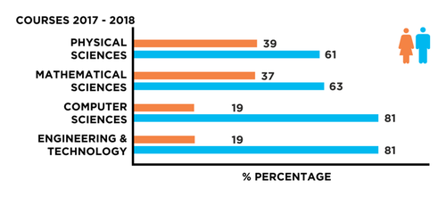

```{r, install remotely, globalsettings, echo=FALSE, warning=FALSE, results='hide', eval=FALSE}
#install.packages("remotes")
#remotes::install_github("rlesur/klippy")
``` 

```{r, globalsettings, echo=FALSE, warning=FALSE, results='hide'}
library(knitr)

knitr::opts_chunk$set(echo = TRUE)
opts_chunk$set(tidy.opts=list(width.cutoff=100),tidy=TRUE, warning = FALSE, message = FALSE,comment = "#>", cache=TRUE, class.source=c("test"), class.output=c("test2"))
options(width = 100)
rgl::setupKnitr()


colorize <- function(x, color) {sprintf("<span style='color: %s;'>%s</span>", color, x) }

```

```{r klippy, echo=FALSE, include=TRUE}
klippy::klippy(position = c('top', 'right'))
#klippy::klippy(color = 'darkred')
#klippy::klippy(tooltip_message = 'Click to copy', tooltip_success = 'Done')
```


----

:::::::::::::: {.columns}
::: {.column width="50%"}

# My Lab Journal
Last compiled on `r format(Sys.time(), '%B, %Y')`  

This is the Lab Journal I use during the course Social Networks. 

<br>

----

##   

Everyone can fork this repository. Use this example to journal your lab work and assignments. 

We, Jochem Tolsma and Bas Hofstra, use this repository for our Social Network Analysis For Social Scientists course [@SNASS]. 


:::
::: {.column width="50%"}





:::
::::::::::::::


## How to use

1. Fork the repository for this website and follow instructions on `README` to get started [here](https://github.com/JochemTolsma/labjournal).  

2. Journal your work, by editing the .Rmd-files

3. ...

4. Change everything to make it your own!


<br>

Use the top menu to navigate through the journal.

----

## Homework week 1

Research Question: To what extent is there a difference between men and women within Sociology and Physics in (1) who they work with and (2) which topics they study compared to three universities (within the Netherlands)? 

Articles: 

Collins, R., & Steffen-Fluhr, N. (2019). Hidden patterns: Using social network analysis to track career trajectories of women STEM faculty. *Equality, Diversity and Inclusion: An International Journal.* 

Jadidi, M., Karimi, F., Lietz, H., & Wagner, C. (2018). Gender disparities in science? Dropout, productivity, collaborations and success of male and female computer scientists. *Advances in Complex Systems, 21*(3-4), 1750011. https://doi.org/10.1142/S0219525917500114

Ghiasi, G., Larivière, V., & Sugimoto, C. R. (2015). On the compliance of women engineers with a gendered scientific system. *PloS one, 10*(12), e0145931. https://doi.org/10.1371/journal.pone.0145931

----

# References


